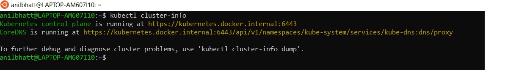

# Setting up KubeFlow 
## Steps to run pytorch cifar10 example pipeline by compiling and uploading to KFP
- Make sure that kubernetes is up
- Running **kubectl cluster-info** should return below url message. This indicates that K8 is up and running.

- After that install kubeflow by following commands

- Do port forwarding so that we can see it in browser via http://localhost:8080/

- Next install kfp python SDK

- Also install kfp - **pip3 install kfp**
- Create a directory and git-clone https://github.com/kubeflow/pipelines.git into it.
- Our aim is to generate **pytorch_cifar10.yaml** from **cifar10/template_mapping.json**
- **cd** into **pytorch-samples** and run

- Now run **python3 cifar10/pipeline.py**
- This will generate the yaml file - **pytorch_cifar10.yaml** 
- This needs to be uploaded to Kubeflow pipeline as shown below:

- Next, we need to create an experiment
- Then, create a run, attach it to the experiment and start it as shown below:

- We can see the runs as below

- Upon clicking a specific run let us say **Run of pytorch_cifar10_third (01cd3)**, we can see their specific details like graph, run_output etc.

